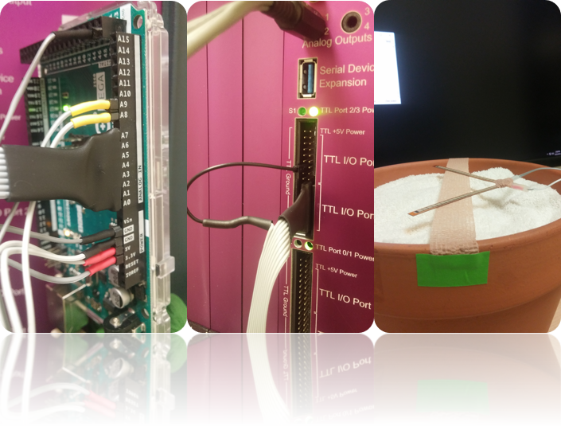
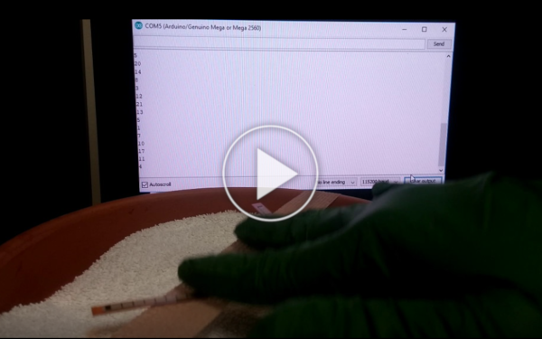

# Flex Sensor
Detect changes on a flex sensor using an Arduino. This setup provides a non-invasive method of detecting movements of a resting subject.

The sensor is attached to an analog input of the Arduino which reports to the serial port any changes detected. The same information is encoded in 8-bits in pins 54 to 61 (A0 to A7) of the Arduino Mega or Arduino Due so that it can be fed to a data acquisition system such as the Digital Lynx and have it synchronized to electrophysiological measurements.

## Principle of operation
Bending the sensor causes changes in resistance that are read at an analog input of the Arduino.
If the sensor is placed in a cushioned surface, any forces applied to this surface will be picked up by the sensor. This can be caused every time that the subject adjusts their body weight, for example.

## Prerequisites
* [Arduino][Arduino] (last compiled and tested with Arduino 1.8.5)
* [Arduino Mega2560][ArduinoMega2560] or [Arduino Due][ArduinoDue]
* [Flex sensor][FlexSensorPart]
* 10KOhm resistor

## Installation

* Install Arduino.
* Download and extract the project folder.
* Setup the flex sensor: Connect one end to +5V and the other end to the resistor to ground. The point between the resistor and the sensor connects to A8 (pin 62) of the Arduino. You may add a second flex sensor and connect it to A9 (pin 63).
* Plug-in the Arduino to the computer, upload code:
	* Open [FlexSensor.ino][FlexSensor.ino]
	* Select Tools/Board/Arduino Mega 2560 (or Arduino Due if using this board and having downloaded support from the Board Manager).
	* Select Tools/Port corresponding to board.
	* Click on Sketch/Upload

## Usage example

## Version History
### 0.1.0
* Initial Release: Library and example code

## License
© 2018 [Leonardo Molina][Leonardo Molina]

This project is licensed under the [GNU GPLv3 License][LICENSE.md].

[Leonardo Molina]: https://github.com/leomol
[LICENSE.md]: LICENSE.md
[Arduino]: https://www.arduino.cc/en/Main/Software
[FlexSensor.ino]: FlexSensor.ino
[ArduinoMega2560]: https://store.arduino.cc/usa/arduino-mega-2560-rev3
[ArduinoDue]: https://store.arduino.cc/usa/arduino-due
[FlexSensorPart]: https://www.adafruit.com/product/182